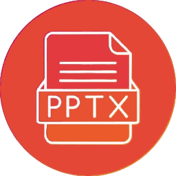

# Distribution Builds

<p align="center">
	
</p>
Both packaged skill distributions include the official skill icon from v1.0.2 onward.
This folder contains packaged builds for different platforms.

## Available packages

| Package | Path | Purpose |
|---|---|---|
| ChatGPT Skill ZIP | `dist/skill.zip` | Upload this to ChatGPT Skills |
| Claude Skill Package | `dist/claude/presentation-pro-designer.skill` | Upload this to Claude if your Claude environment supports custom skill uploads |

## Notes

- `dist/skill.zip` is the ChatGPT-compatible packaged skill.
- `dist/claude/presentation-pro-designer.skill` is a Claude-focused package generated from the original skill and optimised for Claude usage.
- The Claude package includes its own quick-start files in `dist/claude/`.
- If a platform does not support direct skill upload, use the source skill folder instead:

```text
skills/presentation-pro-designer/
```

To rebuild the ChatGPT-compatible skill package:

```bash
python -m cli.presentation_pro_cli export-skill --output dist/skill.zip
```
